# cosmos-system-5

## Implementing a Cognitive Cities Architecture in GitHub

Based on the diagram you shared, I can suggest how to structure this neurological-inspired architecture as a software system in GitHub.
This approach would translate the biological/organizational metaphor into a practical implementation.

### System Overview

```mermaid
graph TB
    subgraph "Neurological Inspiration"
        Brain[🧠 Human Cognitive Architecture<br/>System-5-CNS-ORG.png]
    end
    
    subgraph "GitHub Implementation"
        subgraph "Cerebral Triad (Yellow) - Executive Functions"
            direction TB
            CT[🧠 Neocortex Processing]
            T7[💡 T-7: Thought Service<br/>Right Hemisphere - Intuitive Ideas]
            PD2[🎯 PD-2: Processing Director<br/>Central Coordination]
            P5C[⚡ P-5: Processing Service<br/>Analytical Processing]
            O4C[📤 O-4: Output Service<br/>Left Hemisphere - Applied Output]
        end
        
        subgraph "Somatic Triad (Light Blue) - Behavioral Control"
            direction TB
            ST[🤖 Basal System Processing]
            M1S[🕹️ M-1: Motor Control<br/>Action Coordination]
            S8S[👁️ S-8: Sensory Service<br/>Environmental Input]
            P5S[🧠 P-5: Processing Service<br/>Behavioral Techniques]
            O4S[📡 O-4: Output Service<br/>Response Delivery]
        end
        
        subgraph "Autonomic Triad (Turquoise) - Background Systems"
            direction TB
            AT[⚙️ Autonomic Processing]
            M1A[📊 M-1: Monitoring<br/>System Health]
            S8A[💾 S-8: State Management<br/>Limbic System State]
            PD2A[🔧 PD-2: Process Director<br/>Background Orchestration]
            P5A[❤️ P-5: Processing Service<br/>Emotive Processing]
            T7A[⚡ T-7: Trigger Service<br/>Autonomic Responses]
        end
        
        subgraph "Integration Layer"
            Gateway[🌐 API Gateway<br/>Central Nervous System]
            EventBus[📡 Event Bus<br/>Neural Pathways]
            SharedLib[📚 Cognitive Core<br/>Shared Libraries]
        end
    end
    
    Brain --> Gateway
    Gateway --> CT
    Gateway --> ST  
    Gateway --> AT
    
    CT <--> ST
    ST <--> AT
    AT <--> CT
    
    T7 <--> PD2
    PD2 <--> P5C
    P5C <--> O4C
    
    S8S <--> M1S
    M1S <--> P5S
    P5S <--> O4S
    
    M1A <--> PD2A
    S8A <--> PD2A
    PD2A <--> P5A
    P5A <--> T7A
    
    EventBus <--> T7
    EventBus <--> M1S
    EventBus <--> M1A
    
    SharedLib --> T7
    SharedLib --> M1S
    SharedLib --> M1A
    
    style CT fill:#fff2cc,stroke:#333,stroke-width:2px
    style ST fill:#cce5ff,stroke:#333,stroke-width:2px
    style AT fill:#ccffcc,stroke:#333,stroke-width:2px
    style Brain fill:#ffe6e6,stroke:#333,stroke-width:3px
```



## Architectural Approach

We can implement this as a distributed system with three main components (triads) that mirror the neurological structure in the provided diagram:


This implementation translates the biological cognitive architecture into a distributed microservices system where each brain region corresponds to specific GitHub repositories and services.

## Repository Structure

Create a GitHub organization called "CognitiveCities" with the following repositories:

### Core Repositories (representing the triads):
• cerebral-triad: High-level decision making and coordination
• somatic-triad: Handles voluntary operations and behavior execution
• autonomic-triad: Manages background processes and automated responses

### Supporting Repositories:
• cognitive-core: Shared libraries and utilities
• integration-hub: API gateways and communication protocols
• deployment-configs: Infrastructure as code and deployment scripts

## GitHub Implementation Architecture

```mermaid
graph TD
    subgraph "Neurological Architecture (System-5-CNS-ORG.png)"
        Neo[Neocortex - Executive Functions]
        RH[Right Hemisphere - Intuitive Ideas]
        LH[Left Hemisphere - Applied Techniques]
        BS[Basal System - Somatic Balance]
        LS[Limbic System - Emotive Balance]
        CT[Cerebral Triad - Yellow]
        ST[Somatic Triad - Light Blue]
        AT[Autonomic Triad - Turquoise]
    end
    
    subgraph "GitHub Repository Structure"
        subgraph "cerebral-triad/"
            T7[thought-service/ (T-7)]
            PD2[processing-director/ (PD-2)]
            P5C[processing-service/ (P-5)]
            O4C[output-service/ (O-4)]
        end
        
        subgraph "somatic-triad/"
            M1S[motor-control-service/ (M-1)]
            S8S[sensory-service/ (S-8)]
            P5S[processing-service/ (P-5)]
            O4S[output-service/ (O-4)]
        end
        
        subgraph "autonomic-triad/"
            M1A[monitoring-service/ (M-1)]
            S8A[state-management-service/ (S-8)]
            PD2A[process-director/ (PD-2)]
            P5A[processing-service/ (P-5)]
            T7A[trigger-service/ (T-7)]
        end
        
        subgraph "cognitive-core/"
            SL[shared-libraries/]
            Utils[utilities/]
        end
        
        subgraph "integration-hub/"
            API[api-gateway/]
            EventBus[event-bus/]
        end
    end
    
    %% Mapping connections
    Neo --> CT
    RH --> T7
    LH --> O4C
    CT --> cerebral-triad/
    ST --> somatic-triad/
    AT --> autonomic-triad/
    BS --> M1S
    LS --> P5A
```

## Component Mapping

Map the diagram components to specific microservices:

### Cerebral Triad (Yellow) - Neocortex Executive Functions

```mermaid
graph LR
    subgraph "Cerebral Triad - High-level Cognition"
        T7[T-7<br/>Thought Service<br/>💡 Intuitive Ideas]
        PD2[PD-2<br/>Processing Director<br/>🎯 Coordination]
        P5[P-5<br/>Processing Service<br/>⚡ Analysis]
        O4[O-4<br/>Output Service<br/>📤 Results]
    end
    
    T7 --> PD2
    PD2 --> P5
    PD2 --> O4
    P5 --> O4
    
    style T7 fill:#ff9999
    style PD2 fill:#ff6666
    style P5 fill:#6699ff
    style O4 fill:#66ccff
```


**Neurological Mapping:**
- **T (7)** - Thought Service: Maps to Right Hemisphere intuitive idea generation
- **PD (2)** - Processing Director: Central coordination like the Processing Director in neocortex
- **P (5)** - Processing Service: Analytical processing similar to cerebral processing
- **O (4)** - Output Service: Formatted output delivery like left hemisphere applied techniques

### Somatic Triad (Light Blue) - Voluntary Motor & Sensory Systems


**Neurological Mapping:**
- **M (1)** - Motor Control Service: Maps to Basal System somatic balance and motor control
- **S (8)** - Sensory Service: Environmental sensing and input processing
- **P (5)** - Processing Service: Behavioral technique implementation 
- **O (4)** - Output Service: Behavioral response delivery

### Autonomic Triad (Turquoise) - Automatic Background Processes

```mermaid
graph LR
    subgraph "Autonomic Triad - Background Systems"
        M1A[M-1<br/>Monitoring<br/>📊 Health]
        S8A[S-8<br/>State Management<br/>💾 State]
        PD2A[PD-2<br/>Process Director<br/>⚙️ Orchestration]
        P5A[P-5<br/>Processing Service<br/>❤️ Emotive]
        T7A[T-7<br/>Trigger Service<br/>⚡ Responses]
    end
    
    M1A --> PD2A
    S8A --> PD2A
    PD2A --> P5A
    PD2A --> T7A
    P5A --> T7A
    
    style M1A fill:#66ffcc
    style S8A fill:#66ffcc
    style PD2A fill:#ff6666
    style P5A fill:#6699ff
    style T7A fill:#ff9999
```


**Neurological Mapping:**
- **M (1)** - Monitoring Service: Continuous system health monitoring like autonomic nervous system
- **S (8)** - State Management Service: Maintains system state like limbic system state management
- **PD (2)** - Process Director: Background process orchestration
- **P (5)** - Processing Service: Maps to Limbic System emotive balance and intuitive processing
- **T (7)** - Trigger Service: Automatic response triggering like parasympathetic responses

## Communication Patterns

Implement communication between components using:
Event-driven architecture with message queues (e.g., Kafka, RabbitMQ)
RESTful APIs for direct service-to-service communication
WebSockets for real-time updates between triads

### Inter-Triad Communication Flow


### Service Integration Architecture

```mermaid
graph TB
    subgraph "External Interface"
        Users[👥 Users]
        Systems[🔌 External Systems]
    end
    
    subgraph "Integration Layer"
        Gateway[🌐 API Gateway<br/>Port 3000]
        EventBus[📡 Event Bus<br/>Message Queue]
    end
    
    subgraph "Cerebral Triad - Executive Functions"
        T7[💡 Thought Service<br/>Port 3001]
        PD2[🎯 Processing Director<br/>Port 3002]
        P5C[⚡ Processing Service<br/>Port 3003]
        O4C[📤 Output Service<br/>Port 3004]
    end
    
    subgraph "Somatic Triad - Behavioral Control"
        M1S[🤖 Motor Control<br/>Port 3011]
        S8S[👁️ Sensory Service<br/>Port 3012]
        P5S[🧠 Processing Service<br/>Port 3013]
        O4S[📡 Output Service<br/>Port 3014]
    end
    
    subgraph "Autonomic Triad - Background Systems"
        M1A[📊 Monitoring<br/>Port 3021]
        S8A[💾 State Management<br/>Port 3022]
        PD2A[⚙️ Process Director<br/>Port 3023]
        P5A[❤️ Processing Service<br/>Port 3024]
        T7A[⚡ Trigger Service<br/>Port 3025]
    end
    
    subgraph "Core Infrastructure"
        SharedLib[📚 Shared Libraries]
        Config[⚙️ Configuration]
        Monitor[📈 Monitoring Stack]
    end
    
    Users --> Gateway
    Systems --> Gateway
    Gateway --> T7
    Gateway --> M1S
    Gateway --> M1A
    
    T7 <--> PD2
    PD2 <--> P5C
    P5C <--> O4C
    
    S8S <--> M1S
    M1S <--> P5S
    P5S <--> O4S
    
    M1A <--> PD2A
    S8A <--> PD2A
    PD2A <--> P5A
    P5A <--> T7A
    
    %% Cross-triad communication
    O4C -.-> M1S
    O4S -.-> M1A
    T7A -.-> T7
    
    %% Event bus connections
    EventBus <--> T7
    EventBus <--> M1S
    EventBus <--> M1A
    
    %% Infrastructure connections
    SharedLib --> T7
    SharedLib --> M1S
    SharedLib --> M1A
    Monitor --> M1A
```


## GitHub Implementation
GitHub Actions Workflows:
• Create CI/CD pipelines for each triad
• Implement integration tests between triads
• Set up monitoring and alerting
GitHub Projects:
• Create a project board for each triad
• Set up an integration project board for cross-triad coordination
GitHub Issues:
• Use labels that correspond to the triads and components
• Create issue templates for different types of work
Documentation:
• Create comprehensive README files explaining the neurological metaphor
• Document the interfaces between components
• Provide diagrams showing the relationship to the original concept

## Technical Implementation

For a modern cloud-native implementation:

### GitHub Repository Organization
```
CognitiveCities/cosmos-system-5/
├── 🧠 cerebral-triad/              # Neocortex - Executive Functions
│   ├── 💡 thought-service/         # Right Hemisphere - Intuitive Ideas (T-7)
│   ├── 🎯 processing-director/     # Central Coordination (PD-2)
│   ├── ⚡ processing-service/      # Analytical Processing (P-5)
│   └── 📤 output-service/          # Left Hemisphere - Applied Output (O-4)
├── 🤖 somatic-triad/               # Basal System - Motor Control
│   ├── 🕹️ motor-control-service/   # Motor Functions (M-1)
│   ├── 👁️ sensory-service/         # Sensory Input Processing (S-8)
│   ├── 🧠 processing-service/      # Behavioral Techniques (P-5)
│   └── 📡 output-service/          # Behavioral Responses (O-4)
├── ⚙️ autonomic-triad/             # Autonomic Nervous System
│   ├── 📊 monitoring-service/      # System Health Monitoring (M-1)
│   ├── 💾 state-management/        # Limbic System State (S-8)
│   ├── 🔧 process-director/        # Background Orchestration (PD-2)
│   ├── ❤️ processing-service/      # Emotive Processing (P-5)
│   └── ⚡ trigger-service/         # Autonomic Responses (T-7)
├── 📚 cognitive-core/              # Shared Neural Infrastructure
│   ├── 🔗 shared-libraries/        # Common neural pathways
│   └── 🛠️ utilities/              # Support functions
├── 🌐 integration-hub/             # Neural Network Integration
│   ├── 🚪 api-gateway/             # Central nervous system gateway
│   └── 📡 event-bus/               # Neural communication pathways
└── 🚀 deployment-configs/          # Infrastructure DNA
    ├── ☸️ kubernetes/              # Container orchestration
    ├── 🏗️ terraform/               # Infrastructure as code
    └── 📈 monitoring/              # System health monitoring
```

### Neurological to GitHub Mapping


## Implementation Status

### ✅ Completed Components

#### Core Infrastructure
- [x] **Directory Structure**: Complete triad and service organization
- [x] **Shared Libraries**: Base service classes and communication interfaces
- [x] **TypeScript Configuration**: Project-wide type safety and compilation
- [x] **Docker Configuration**: Containerization for all services
- [x] **GitHub Actions**: CI/CD pipeline for automated testing and deployment

#### Cerebral Triad
- [x] **Thought Service (T-7)**: ✅ **FULLY IMPLEMENTED**
  - Generates intuitive ideas and potential solutions
  - Multi-domain knowledge base (technology, urban-planning)
  - Confidence scoring and association mapping
  - RESTful API with comprehensive endpoints
  - **Status**: Running on port 3001, fully functional

- [x] **Processing Director (PD-2)**: ✅ **FULLY IMPLEMENTED**
  - Coordinates processing of information between services
  - Creates and manages processing plans
  - Service discovery and orchestration
  - RESTful API with coordination endpoints
  - **Status**: Running on port 3002, fully functional

- [x] **Processing Service (P-5)**: ✅ **FULLY IMPLEMENTED**
  - Executes analytical processing operations
  - Advanced analytics engine with multiple algorithms
  - Data preprocessing, analysis, and optimization
  - RESTful API with processing capabilities
  - **Status**: Running on port 3003, fully functional

- [x] **Output Service (O-4)**: ✅ **FULLY IMPLEMENTED**
  - Formats and delivers processed information
  - Multiple output formats (JSON, XML, CSV, HTML, Markdown)
  - Template system for customized outputs
  - RESTful API with formatting and delivery endpoints
  - **Status**: Running on port 3004, fully functional

- [x] **Sales Service (S-8)**: ✅ **FULLY IMPLEMENTED** - *NEW in System 5*
  - Quality assurance and output promotion
  - Performance Dimension [8-1]: Sales→Market flow
  - Quality assessment with multi-dimensional scoring
  - Market readiness checking and optimization
  - RESTful API with quality and promotion endpoints
  - **Status**: Running on port 3005, fully functional

- [x] **Market Service (M-1)**: ✅ **FULLY IMPLEMENTED** - *NEW in System 5*
  - Market presentation and external interface
  - Performance Dimension [8-1]: Receives Sales→Market flow
  - Market analysis and trend identification
  - External interface management and registration
  - Performance feedback processing with optimization
  - **Status**: Running on port 3006, fully functional

#### Integration Hub
- [x] **API Gateway**: ✅ **FULLY IMPLEMENTED**
  - Service discovery and routing
  - Load balancing and health checks
  - Comprehensive API documentation endpoint
  - Error handling and monitoring
  - **Status**: Ready for deployment on port 3000

#### Deployment & Operations
- [x] **Kubernetes Manifests**: Production-ready container orchestration
- [x] **Prometheus Monitoring**: Service health and metrics collection
- [x] **Docker Compose**: Local development environment
- [x] **GitHub Issue Templates**: Triad-specific issue management

#### Somatic Triad
- [x] **Motor Control Service (M-1)**: ✅ **FULLY IMPLEMENTED**
  - Coordinates actions and behaviors
  - Multi-step behavioral sequencing and planning
  - Dependency management and execution monitoring
  - RESTful API with coordination and execution endpoints
  - **Status**: Running on port 3011, fully functional

- [x] **Sensory Service (S-8)**: ✅ **FULLY IMPLEMENTED**
  - Collects and processes external inputs
  - Multi-modal sensor data processing (visual, audio, environmental, digital)
  - Real-time signal processing and pattern recognition
  - RESTful API with collection and processing endpoints
  - **Status**: Running on port 3012, fully functional

- [x] **Processing Service (P-5)**: ✅ **FULLY IMPLEMENTED**
  - Handles behavioral technique implementation
  - Adaptive behavior processing and learning
  - Context-aware behavioral adaptation
  - RESTful API with technique processing endpoints
  - **Status**: Running on port 3013, fully functional

- [x] **Output Service (O-4)**: ✅ **FULLY IMPLEMENTED**
  - Delivers behavioral responses
  - Multi-target coordination and real-time execution
  - Adaptive response formatting and delivery
  - RESTful API with delivery and coordination endpoints
  - **Status**: Running on port 3014, fully functional

- [x] **Development Service (PD-2)**: ✅ **FULLY IMPLEMENTED** - *NEW in System 5*
  - Motor development coordination (Shared Parasympathetic Polarity)
  - Potential Dimension [2-7]: Development→Treasury flow
  - Motor skill development plans and behavioral optimization
  - Resource allocation and parasympathetic coordination with Autonomic triad
  - RESTful API with development and coordination endpoints
  - **Status**: Running on port 3015, fully functional

- [x] **Treasury Service (T-7)**: ✅ **FULLY IMPLEMENTED** - *NEW in System 5*
  - Motor memory and learned skills storage (Shared Parasympathetic Polarity)
  - Potential Dimension [2-7]: Receives Development→Treasury flow
  - Motor memory storage and retrieval with proficiency tracking
  - Skill integration and learned pattern management
  - RESTful API with memory and skill management endpoints
  - **Status**: Running on port 3016, fully functional

#### Autonomic Triad
- [x] **Monitoring Service (M-1)**: ✅ **FULLY IMPLEMENTED**
  - Automatic system monitoring and health assessment
  - Performance metrics collection and analysis
  - Anomaly detection and alerting
  - Resource usage tracking
  - RESTful API with monitoring and alerting endpoints
  - **Status**: Running on port 3021, fully functional

- [x] **State Management Service (S-8)**: ✅ **FULLY IMPLEMENTED**
  - Maintains global system state and configuration
  - Centralized state management and synchronization
  - Configuration persistence and retrieval
  - Backup and recovery operations
  - RESTful API with state and configuration endpoints
  - **Status**: Running on port 3022, fully functional

- [x] **Process Director (PD-2)**: ✅ **FULLY IMPLEMENTED**
  - Manages background processes and automation workflows
  - Background process orchestration and scheduling
  - Automated workflow execution and queuing
  - Resource allocation and management
  - RESTful API with process management endpoints
  - **Status**: Running on port 3023, fully functional

- [x] **Processing Service (P-5)**: ✅ **FULLY IMPLEMENTED**
  - Handles emotive and intuitive background processing
  - Emotive response processing and pattern recognition
  - Adaptive behavior learning and emotional context analysis
  - Subconscious processing simulation
  - RESTful API with emotive processing endpoints
  - **Status**: Running on port 3024, fully functional

- [x] **Trigger Service (T-7)**: ✅ **FULLY IMPLEMENTED**
  - Initiates automatic responses and reactions
  - Event-driven response triggering and automated reaction systems
  - Threshold-based alerting and emergency response coordination
  - Reflex action simulation
  - RESTful API with trigger and response endpoints
  - **Status**: Running on port 3025, fully functional

- [x] **Organization Service (O-4)**: ✅ **FULLY IMPLEMENTED** - *NEW in System 5*
  - Background system coordination and organization
  - Commitment Dimension [5-4]: Production→Organization flow
  - System organization management and background coordination
  - Maintenance scheduling and execution
  - State synchronization with State Management service
  - RESTful API with organization and maintenance endpoints
  - **Status**: Running on port 3026, fully functional

### 🎉 System 5 Complete: 18-Service [[D-T]-[P-O]-[S-M]] Architecture

The complete System 5 implementation now provides **18 services** following the neurological [[D-T]-[P-O]-[S-M]] pattern:

| Triad | [D-T] 2-7 | [P-O] 5-4 | [S-M] 8-1 | Total |
|-------|-----------|-----------|-----------|-------|
| **Cerebral** | PD-2, T-7 | P-5, O-4 | S-8, M-1 | 6 |
| **Somatic** | PD-2*, T-7* | P-5, O-4 | S-8, M-1 | 6 |
| **Autonomic** | PD-2, T-7 | P-5, O-4 | S-8, M-1 | 6 |
| **Total** | 6 | 6 | 6 | **18** |

*\*Shared Parasympathetic Polarity between Somatic and Autonomic triads*

### 🚧 Planned Components

#### Autonomic Triad
- [x] **Monitoring Service (M-1)**: ✅ **FULLY IMPLEMENTED**
  - Automatic system monitoring and health assessment
  - Performance metrics collection and analysis
  - Anomaly detection and alerting
  - Resource usage tracking
  - RESTful API with monitoring and alerting endpoints
  - **Status**: Running on port 3021, fully functional

- [x] **State Management Service (S-8)**: ✅ **FULLY IMPLEMENTED**
  - Maintains global system state and configuration
  - Centralized state management and synchronization
  - Configuration persistence and retrieval
  - Backup and recovery operations
  - RESTful API with state and configuration endpoints
  - **Status**: Running on port 3022, fully functional

- [x] **Process Director (PD-2)**: ✅ **FULLY IMPLEMENTED**
  - Manages background processes and automation workflows
  - Background process orchestration and scheduling
  - Automated workflow execution and queuing
  - Resource allocation and management
  - RESTful API with process management endpoints
  - **Status**: Running on port 3023, fully functional

- [x] **Processing Service (P-5)**: ✅ **FULLY IMPLEMENTED**
  - Handles emotive and intuitive background processing
  - Emotive response processing and pattern recognition
  - Adaptive behavior learning and emotional context analysis
  - Subconscious processing simulation
  - RESTful API with emotive processing endpoints
  - **Status**: Running on port 3024, fully functional

- [x] **Trigger Service (T-7)**: ✅ **FULLY IMPLEMENTED**
  - Initiates automatic responses and reactions
  - Event-driven response triggering and automated reaction systems
  - Threshold-based alerting and emergency response coordination
  - Reflex action simulation
  - RESTful API with trigger and response endpoints
  - **Status**: Running on port 3025, fully functional
#### ML Core - Advanced Features Phase
- 🚧 **Predictive Engine**: **IN PROGRESS** - Core algorithms implemented, integration pending
  - Basic time series prediction and anomaly detection
  - Statistical analysis and trend forecasting capabilities
  - Message-based service architecture following BaseService pattern
  - **Status**: Core functionality ready, requires deployment integration

- 🚧 **Pattern Analyzer**: **IN PROGRESS** - Pattern recognition framework established
  - Behavioral and interaction pattern analysis infrastructure
  - Real-time monitoring capabilities designed
  - Cross-triad optimization pattern detection
  - **Status**: Architecture defined, implementation requires completion

- 🚧 **Adaptive Optimizer**: **IN PROGRESS** - Self-learning optimization framework
  - Cross-triad coordination optimization design
  - Adaptive configuration management structure
  - Performance tuning and resource optimization planning
  - **Status**: Framework designed, requires full implementation

- [x] **Real-time Analytics Dashboard**: ✅ **FULLY IMPLEMENTED**
  - Live system monitoring and real-time metrics visualization
  - WebSocket-based dashboard with interactive controls
  - Health monitoring, alert management, and performance analytics
  - Optimization insights and ML model performance tracking
  - Historical data analysis and report generation
  - **Status**: Service implementation ready for deployment

## Production Deployment Guide

### 🚀 Infrastructure as Code (Terraform)

The production deployment uses AWS EKS with Terraform for infrastructure management:

```bash
# Deploy infrastructure
cd deployment-configs/terraform
terraform init
terraform plan
terraform apply
```

**Infrastructure Features:**
- ✅ **Multi-AZ EKS Cluster**: High availability across availability zones
- ✅ **Node Groups per Triad**: Dedicated compute resources for each neurological function
- ✅ **VPC with Public/Private Subnets**: Secure network architecture
- ✅ **Load Balancers & Auto Scaling**: Dynamic scaling based on load
- ✅ **Security Groups & Network Policies**: Defense in depth security

### ☸️ Kubernetes Production Deployment

Enhanced Kubernetes manifests with production-ready configurations:

```bash
# Deploy to production
kubectl apply -f deployment-configs/kubernetes/production-deployment.yaml

# Verify deployment
kubectl get pods -n cognitive-cities
kubectl get services -n cognitive-cities
```

**Production Features:**
- ✅ **High Availability**: Multi-replica deployments with anti-affinity rules
- ✅ **Health Checks**: Comprehensive liveness and readiness probes
- ✅ **Resource Management**: CPU/memory requests and limits
- ✅ **Auto Scaling**: Horizontal Pod Autoscalers (HPA)
- ✅ **Security Context**: Non-root containers with read-only filesystems
- ✅ **Network Policies**: Micro-segmentation for enhanced security

### 📊 Monitoring & Observability

Production-grade monitoring with Prometheus and alerting:

```bash
# Deploy monitoring stack
kubectl apply -f deployment-configs/monitoring/
```

**Monitoring Stack:**
- ✅ **Prometheus**: Metrics collection with triad-specific configurations
- ✅ **Alert Rules**: Service-specific alerts for each neurological function
- ✅ **Grafana Dashboards**: Visual analytics for system health
- ✅ **CloudWatch Integration**: AWS native monitoring and logging
- ✅ **Distributed Tracing**: Request flow across triads

### 🔄 CI/CD Pipeline

Automated build, test, and deployment pipeline:

```yaml
# .github/workflows/production-pipeline.yml
- Quality Gates: Linting, security scanning, testing
- Multi-stage Build: Separate builds for each triad
- Integration Testing: Cross-triad functionality validation
- Container Registry: AWS ECR with image scanning
- Progressive Deployment: Blue-green deployment strategy
- Rollback Capability: Automated rollback on failure
```

### 🔒 Security & Compliance

Production security measures:

- ✅ **Container Security**: Image scanning and vulnerability assessment
- ✅ **Network Security**: VPC, security groups, and network policies
- ✅ **Access Control**: RBAC with least-privilege principles
- ✅ **Secrets Management**: AWS Secrets Manager integration
- ✅ **Audit Logging**: Comprehensive audit trails

### 📈 Performance & Scaling

Optimized for production workloads:

- ✅ **Auto Scaling**: CPU and memory-based scaling
- ✅ **Load Balancing**: Multi-AZ load distribution
- ✅ **Resource Optimization**: Right-sized containers
- ✅ **Caching Strategy**: Redis integration for performance
- ✅ **Database Optimization**: Connection pooling and indexing

## Quick Start Guide

### Prerequisites
- Node.js 18+
- Docker & Docker Compose
- Kubernetes (optional, for production deployment)

### Local Development

1. **Clone and Install**
   ```bash
   git clone https://github.com/EchoCog/cosmos-system-5.git
   cd cosmos-system-5
   npm install
   ```

2. **Build Core Libraries**
   ```bash
   cd cognitive-core/shared-libraries
   npm install && npm run build
   ```

3. **Start the Processing Director**
   ```bash
   cd cerebral-triad/processing-director
   npm install && npm run build
   npm start  # Runs on port 3002
   ```

4. **Start the Processing Service**
   ```bash
   cd cerebral-triad/processing-service
   npm install && npm run build
   npm start  # Runs on port 3003
   ```

5. **Start the Output Service**
   ```bash
   cd cerebral-triad/output-service
   npm install && npm run build
   npm start  # Runs on port 3004
   ```

6. **Test the Complete Cerebral Triad**
   ```bash
   # Test Thought Service
   curl -X POST http://localhost:3001/generate \
     -H "Content-Type: application/json" \
     -d '{
       "context": "smart city traffic",
       "domain": "technology", 
       "complexity": "medium",
       "timeframe": 30
     }'

   # Test Processing Director
   curl -X POST http://localhost:3002/coordinate \
     -H "Content-Type: application/json" \
     -d '{
       "thoughtsData": [{"id": "test", "content": "sample data"}],
       "processingType": "analysis",
       "priority": "medium",
       "requiredServices": ["processing-service"]
     }'

   # Test Processing Service
   curl http://localhost:3003/capabilities

   # Test Output Service
   curl http://localhost:3004/formats
   ```

### Docker Deployment

```bash
# Build and start all services
docker-compose up --build

# Access API Gateway
curl http://localhost:3000/api/docs
```

### Kubernetes Deployment

```bash
# Deploy to Kubernetes cluster
kubectl apply -f deployment-configs/kubernetes/cognitive-cities.yaml

# Check status
kubectl get pods -n cognitive-cities
```

## Architecture Highlights

### 🧠 Neurological Inspiration

The architecture mirrors human cognitive processes based on the neurological diagram (System-5-CNS-ORG.png):

#### Brain Region Mapping


#### Polarity-Based Function Distribution (16 vs 18 Functions)

The system implements **16 functional implementations instead of 18** due to shared parasympathetic functions:

| Triad | Sympathetic | Parasympathetic | Somatic | Total |
|-------|-------------|-----------------|---------|-------|
| **Cerebral** | T-7 | PD-2 | P-5, O-4 | 4 |
| **Somatic** | M-1, O-4 | *[Shared]* | S-8, P-5 | 4 |
| **Autonomic** | T-7 | M-1, S-8, PD-2* | P-5 | 5 |
| **Shared Implementations** | - | +3 | - | +3 |
| **Total** | 4 | 6 | 5 | **16** |

*Parasympathetic functions (M-1, S-8, PD-2) serve both Somatic and Autonomic triads, creating 16 total functional implementations*

For detailed polarity analysis, see [POLARITY_STRUCTURE.md](POLARITY_STRUCTURE.md).

#### Neurological Service Correspondence

| Brain Region | Neurological Function | Software Service | Implementation |
|--------------|----------------------|------------------|----------------|
| **Right Hemisphere** | Intuitive idea generation, pattern recognition | Thought Service (T-7) | Generates creative solutions and potential ideas |
| **Left Hemisphere** | Applied techniques, logical output | Output Service (O-4) | Formats and structures responses logically |
| **Processing Director** | Central coordination and control | Processing Director (PD-2) | Orchestrates information flow between services |
| **Neocortex Processing** | Analytical thinking and reasoning | Processing Service (P-5) | Performs detailed analysis and reasoning |
| **Basal System** | Motor control and somatic balance | Motor Control Service (M-1) | Coordinates system actions and behaviors |
| **Sensory Systems** | Environmental input processing | Sensory Service (S-8) | Processes external inputs and environmental data |
| **Limbic System** | Emotional processing and state | State Management (S-8) / Processing (P-5) | Manages system emotional state and context |
| **Autonomic Nervous System** | Background monitoring and control | Monitoring Service (M-1) | Continuous health and performance monitoring |
| **Sympathetic Response** | Active response and alertness | Trigger Service (T-7) | Initiates immediate responses to system events |
| **Parasympathetic Response** | Rest and maintenance functions | Background processing | Handles system maintenance and optimization |

### 🔧 Modern Tech Stack
- **Language**: TypeScript/Node.js for type safety and performance
- **Communication**: Event-driven architecture with REST APIs
- **Containerization**: Docker with Kubernetes orchestration
- **Monitoring**: Prometheus metrics and health checks
- **CI/CD**: GitHub Actions with automated testing

### 📊 Service Discovery
The API Gateway provides automatic service routing:
```
http://localhost:3000/cerebral/thoughts    → Thought Service (T-7)
http://localhost:3000/cerebral/coordinate  → Processing Director (PD-2)
http://localhost:3000/cerebral/process     → Processing Service (P-5)
http://localhost:3000/cerebral/output      → Output Service (O-4)
http://localhost:3000/somatic/motor        → Motor Control Service (M-1)
http://localhost:3000/somatic/sensory      → Sensory Service (S-8)
http://localhost:3000/somatic/process      → Somatic Processing Service (P-5)
http://localhost:3000/somatic/output       → Somatic Output Service (O-4)
http://localhost:3000/autonomic/monitor    → Monitoring Service (M-1)
http://localhost:3000/autonomic/state      → State Management Service (S-8)
http://localhost:3000/autonomic/director   → Process Director (PD-2)
http://localhost:3000/autonomic/process    → Processing Service (P-5)
http://localhost:3000/autonomic/trigger    → Trigger Service (T-7)
```

## Next Steps

1. **✅ Expand Cerebral Triad**: ✅ **COMPLETED** - All services (T-7, PD-2, P-5, O-4) implemented
2. **✅ Implement Somatic Triad**: ✅ **COMPLETED** - All services (M-1, S-8, P-5, O-4) implemented
3. **✅ Develop Autonomic Triad**: ✅ **COMPLETED** - All services (M-1, S-8, PD-2, P-5, T-7) implemented
4. **🚧 Advanced Features**: Machine learning integration, real-time analytics
   - 🚧 **ML Core Infrastructure**: Services implemented, integration in progress
   - ✅ **Real-time Analytics Dashboard**: Live system monitoring and visualization
   - 🚧 **Cross-triad Optimization**: Coordination and efficiency improvements
   - 🚧 **Self-healing Capabilities**: Automated recovery and adaptation
5. **🚀 Production Deployment**: ✅ **IN PROGRESS** - Cloud infrastructure and scaling
   - ✅ **Infrastructure as Code**: Terraform configurations for AWS EKS
   - ✅ **Enhanced Kubernetes Deployment**: Production-ready manifests with HA
   - ✅ **CI/CD Pipeline**: Complete build, test, and deployment automation
   - ✅ **Monitoring & Alerting**: Prometheus, Grafana, and alert rules
   - ✅ **Security & Compliance**: Network policies, security contexts
   - 🚧 **Load Testing & Performance Optimization**: Stress testing and tuning

## Documentation

### 📚 Comprehensive Guides
- [📋 **Complete Architecture Documentation**](ARCHITECTURE.md) - Detailed neurological mapping and service specifications
- [🔄 **GitHub Workflow Integration**](GITHUB_WORKFLOWS.md) - CI/CD and development workflow mapping to neural systems
- [🧠 **Cerebral Triad Documentation**](cerebral-triad/README.md) - Executive functions and decision-making services
- [🤖 **Somatic Triad Documentation**](somatic-triad/README.md) - Motor control and behavioral response services  
- [⚙️ **Autonomic Triad Documentation**](autonomic-triad/README.md) - Background processing and monitoring services

### 🎯 Quick References
- [🌐 **API Gateway Endpoints**](#service-discovery) - Service routing and communication
- [🚀 **Quick Start Guide**](#quick-start-guide) - Get the system running in minutes
- [📊 **Implementation Status**](#implementation-status) - Current development progress
- [🔧 **Technical Implementation**](#technical-implementation) - Repository structure and organization

## Contributing

See individual triad README files for detailed service specifications:
- [Cerebral Triad Documentation](cerebral-triad/README.md)
- [Somatic Triad Documentation](somatic-triad/README.md)
- [Autonomic Triad Documentation](autonomic-triad/README.md)

For comprehensive neurological mapping and architectural details:
- [📋 Complete Architecture Documentation](ARCHITECTURE.md)

For issues and feature requests, use the appropriate triad-specific GitHub issue templates.

## Architecture Reference

The complete neurological architecture is documented in the reference diagram:


*Figure: Company & Nervous System Integration (Adapted from Science and Cosmic Order)*

This diagram serves as the foundation for all service mappings and architectural decisions in the Cognitive Cities implementation.
